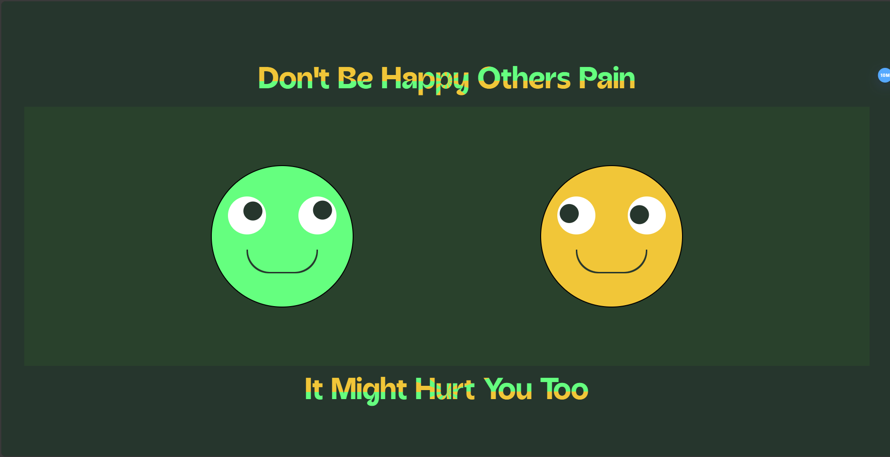

## [Eye Follow Mouse] - Interactive Web Project

**Description:**

This repository demonstrates the creation of an interactive web experience where a pair of eyes follow the user's mouse cursor across the screen. The project utilizes the fundamental web development technologies of HTML, CSS, and JavaScript.



**Features:**

Eye elements dynamically track mouse movement with smooth animations.

**Technologies:**

* HTML
* CSS
* JavaScript (Vanilla JavaScript)

**How to Run:**

1. **Clone** or download the repository to your local machine.
   ```bash
   https://github.com/TemesgenMeles/Eye_Follow_Mouse.git
2. Open the *_index.html_* file in your web browser.
3. Move your mouse around the screen to observe the eyes following your cursor.

**Project Structure:**
  
    EYE_FOLLOW_MOUSE
      │   index.html   (Main HTML file and JavaScript code for mouse tracking and animation)
      │   style.css    (CSS styles for the eyes)
      │
      ├───fonts
      │       Acorn_Bold.ttf    (Font using in the project)
      │
      └───images
              eye_follow_mouse.png

**About:**

This project is intended for web development enthusiasts who want to practice:
- Event handling (mouse movement)
- DOM manipulation
- Basic JavaScript animation concepts

**Contributing:**

We welcome contributions to this project! Feel free to submit pull requests that improve the functionality, design, or documentation.

**Contact:**

Feel free to reach out to [@Temesgen](mailto:temesgen12m1@gmail.com) if you have any questions or suggestions.
